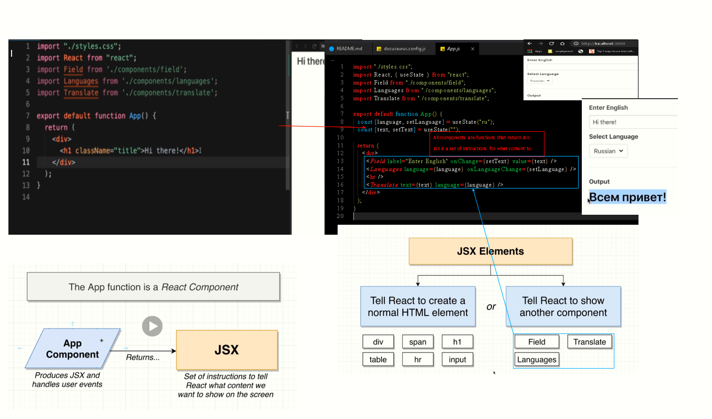

# Introduction

## Introduction

```text
t|15:03:54|bryan@LAPTOP-9LGJ3JGS:[react-translator] react-translator_exitstatus:0__________________________________________________________o>

tree 
.
├── package-lock.json
├── package.json
├── public
│   └── index.html
└── src
    ├── App.js
    ├── components
    │   ├── field.js
    │   ├── languages.js
    │   └── translate.js
    ├── index.js
    └── styles.css


3 directories, 9 files
```

### Index.html

```markup
<!DOCTYPE html>
<html lang="en">
  <head>
    <meta charset="utf-8" />
    <meta
      name="viewport"
      content="width=device-width, initial-scale=1, shrink-to-fit=no"
    />
    <meta name="theme-color" content="#000000" />
    <script
      defer
      src="https://use.fontawesome.com/releases/v5.3.1/js/all.js"
    ></script>
    <link
      rel="stylesheet"
      href="https://cdnjs.cloudflare.com/ajax/libs/bulma/0.7.5/css/bulma.min.css"
    />
    <!--
      manifest.json provides metadata used when your web app is added to the
      homescreen on Android. See https://developers.google.com/web/fundamentals/engage-and-retain/web-app-manifest/
    -->
    <link rel="manifest" href="%PUBLIC_URL%/manifest.json" />
    <link rel="shortcut icon" href="%PUBLIC_URL%/favicon.ico" />
    <!--
      Notice the use of %PUBLIC_URL% in the tags above.
      It will be replaced with the URL of the `public` folder during the build.
      Only files inside the `public` folder can be referenced from the HTML.

      Unlike "/favicon.ico" or "favicon.ico", "%PUBLIC_URL%/favicon.ico" will
      work correctly both with client-side routing and a non-root public URL.
      Learn how to configure a non-root public URL by running `npm run build`.
    -->
    <title>React App</title>
  </head>

  <body>
    <noscript>
      You need to enable JavaScript to run this app.
    </noscript>
    <div class="container" id="root"></div>
    <!--
      This HTML file is a template.
      If you open it directly in the browser, you will see an empty page.

      You can add webfonts, meta tags, or analytics to this file.
      The build step will place the bundled scripts into the <body> tag.

      To begin the development, run `npm start` or `yarn start`.
      To create a production bundle, use `npm run build` or `yarn build`.
    -->
  </body>
</html>
```

## App.js:

```javascript
import "./styles.css";
import React, { useState } from "react";
import Field from "./components/field";
import Languages from "./components/languages";
import Translate from "./components/translate";

export default function App() {
  const [language, setLanguage] = useState("ru");
  const [text, setText] = useState("");

  return (
    <div>
      <Field label="Enter English" onChange={setText} value={text} />
      <Languages language={language} onLanguageChange={setLanguage} />
      <hr />
      <Translate text={text} language={language} />
    </div>
  );
}
```

### Index.js

```javascript
import React from "react";
import ReactDOM from "react-dom";
import App from "./App";

ReactDOM.render(<App />, document.getElementById("root"));


```





If a given tag is a component react will walk through the contents of that tag... and evaluate if it is a vanilla html component... if react decides it is not it will parse through the react component and inspect it's children components.


#### First argument to ReactDOM.render\(

#### -----&gt; is App component or app function...we are telling react that we want to import all the code used in the app.js file.

#### Second argument is a reference to where we want to show the component with respect to root in index.html \(where to display\)

#### Difference between react and reactDOM?


ReactDOM is a Renderer


## State System:


#### We want to store some piece of data that will change over time... we want to store state about what language the user selects and what they type into the form... both of which are subject to change over time.


